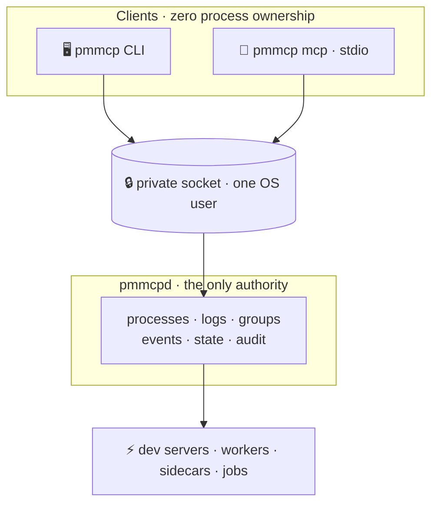

<div align="center">

# pmmcp

### ⚡ Supervised processes for agents — where `nohup` used to be.

**A long-lived user daemon. A first-class MCP control plane. A CLI that never lies.**<br/>
Named processes · strict sandboxes · real logs · real audit · real restarts.

[](https://github.com/scrothers/pmmcp/actions/workflows/ci.yml)
[](https://scorecard.dev/viewer/?uri=github.com/scrothers/pmmcp)
[](https://pkg.go.dev/github.com/scrothers/pmmcp)
[](go.mod)
[](#-sandbox-by-default--fail-closed)
[](#-sixty-five-mcp-tools--full-cli-parity)
[](LICENSE.md)

[🚀 Quick start](#-quick-start) · [✨ Why](#-why-this-exists) · [🎁 Features](#-what-you-get) · [🤖 MCP](#-sixty-five-mcp-tools--full-cli-parity) · [📚 Docs](#-documentation) · [🔒 Security](#-security-in-one-breath)

</div>

---

**pmmcp** is an open-source, **agent-native process platform**.

Not a shell trick. Not a Node-only manager. Not a mini-Kubernetes.<br/>
**The structured place agents — and humans — run work on a machine.**



| Binary | Role |
|--------|------|
| **`pmmcpd`** | The daemon. Owns every managed process, its logs, and all state. **Outlives every client.** |
| **`pmmcp`** | The client. CLI **and** stdio MCP adapter — same API, same rules, **zero** process ownership. |

> [!IMPORTANT]
> **An agent that can start work must also be able to see it, stop it, and prove what it did — without reading your `~/.ssh`.**

---

## ✨ Why this exists

AI agents need long-lived work on a developer machine: dev servers, test runners, workers, sidecars. Today they fall back to:

| Painful default | What goes wrong |
|-----------------|-----------------|
| `nohup … &` | Orphaned PIDs, no identity, no audit |
| Opaque background shells | Agents can't inspect or cleanly stop |
| Ad-hoc tmux sessions | Human theater, not tool-calling |
| Human/Node process managers | Not built for MCP, argv safety, or sandboxes |

Those tools don't give agents **identity, sandboxing, structured lifecycle, inspectable logs, or an honest audit trail.**

**pmmcp does.**

---

## 🚀 Quick start

```bash
# build from source …
go build -o bin/pmmcp  ./cmd/pmmcp
go build -o bin/pmmcpd ./cmd/pmmcpd

# … or install directly
go install github.com/scrothers/pmmcp/cmd/pmmcp@latest
go install github.com/scrothers/pmmcp/cmd/pmmcpd@latest
```

```bash
# terminal 1 — you start the daemon deliberately (never auto-spawned)
./bin/pmmcpd run
# or: ./bin/pmmcp install-service   # systemd --user / LaunchAgent / Windows notes

# terminal 2 — prove the world
./bin/pmmcp doctor
./bin/pmmcp start --name demo --sandbox off -- sleep 3600
./bin/pmmcp list
./bin/pmmcp logs demo
./bin/pmmcp stop demo
```

> [!TIP]
> Default sandbox is **strict**. `--sandbox off` above is only for a trivial smoke test — omit it in real work so isolation stays on.

<details>
<summary><strong>Wire an agent (MCP)</strong> — daemon must already be running</summary>

<br/>

```bash
./bin/pmmcp mcp
```

```json
{
  "mcpServers": {
    "pmmcp": {
      "command": "/path/to/pmmcp",
      "args": ["mcp"],
      "env": {
        "PMMCP_PROJECT": "/home/you/code/my-app"
      }
    }
  }
}
```

MCP protocol → **[docs/mcp.md](docs/mcp.md)** · per-harness setup → **[docs/integration/](docs/integration/README.md)**

</details>

First supervised process in ~10 minutes → **[docs/quickstart.md](docs/quickstart.md)** · Install → **[docs/install.md](docs/install.md)**

---

## 🎁 What you get

### 🔁 Lifecycle agents can trust

Start · stop · restart · list · status · remove · one-shot jobs · enable/disable · wait · health checks.

Every process has a **prefixed ULID** (`proc-…`), a **project-scoped name**, a **status**, and a **log directory**.
Close the agent. Close the terminal. **The process keeps running** — the daemon is the parent.

```bash
pmmcp start --name web -- npm run dev
pmmcp list
pmmcp status web
pmmcp logs web
pmmcp stop web
```

### 🤖 Sixty-five MCP tools · full CLI parity

One catalog. Two costumes. Whatever you type at the terminal, the agent can call as `pm_*`.

| Surface | Highlights |
|---------|------------|
| **Lifecycle** | `pm_start` · `pm_stop` · `pm_restart` · `pm_list` · `pm_status` · `pm_run` · `pm_wait` · … |
| **Groups** | create · start · stop · restart · `depends_on` ordering |
| **Logs** | tail · grep · errors · export · ship · live subscribe |
| **Events & audit** | lifecycle events · who did what · metrics snapshot |
| **Declare** | validate · diff · apply a `pmmcp.yaml` |
| **Secrets** | list · ref-check · set (**no** raw secrets in tool args) |
| **Watch & webhooks** | hot reload · SSRF-aware outbound hooks |
| **Import** | Procfile → pmmcp (Compose planned) |

Plus MCP **resources** (`pmmcp://processes`, `pmmcp://daemon`, …) and **prompts** (`pmmcp_start_safe`, `pmmcp_debug_crash`, …).

### 🔐 Sandbox by default · fail closed

Every child starts **strict** unless you deliberately relax it — and relaxing is capability-gated and **audited**.

| OS | How isolation holds |
|----|---------------------|
| **Linux** | **bubblewrap** namespaces + secret-path deny · loopback-only on strict · fail closed without `bwrap` |
| **macOS** | **sandbox-exec** seatbelt profile denying secret trees |
| **Windows** | **Job Object** (`KILL_ON_JOB_CLOSE`) + tree terminate |

Strict means: project directory **yes**; `~/.ssh`, cloud credentials, engine sockets — **no**.
If isolation cannot be applied, the process **does not start unsandboxed**. It does not start at all.

### 🐚 Argv, not shell

```diff
+ ["npm", "run", "dev"]   ✅ one argument list forever
- "npm run dev"           ❌ never wrapped in sh -c for you
```

No hidden word-splitting. No injection via a filename. When an agent builds a command from untrusted input, this is the difference between *run the program* and *run whatever the string said*.

### 🗂️ Project · profile · session

| Scope | What it is |
|-------|------------|
| **Project** | Working tree (git root / `pmmcp.yaml` / cwd). Names unique *here*, not globally. |
| **Profile** | Named defaults — sandbox posture, env, restart policy. `default` if you pick nothing. |
| **Session** | Who is asking right now (CLI or MCP). For audit & optional `stop_on_disconnect`. |

### ♻️ Supervision that survives reboots

Restart policies · health checks · app groups with `depends_on` · **boot relaunch** for enabled processes · hot-reload watch · resource limits.

### 📦 Containers when you need them

Same verbs — `start` / `stop` / `status` / `logs` — whether the work is a **local** OS process or a **container** via Podman (preferred) or Docker. No silent fall-back to unsandboxed host execution.

### 🤫 Secrets that stay secrets

Env-files · file keyring · **SOPS** · `secret://` URIs.
Log capture **redacts** sensitive shapes. Prefer refs over raw values in agent tool args.

### 🌊 Three streams — never conflated

| Stream | Meaning | You read it with |
|--------|---------|------------------|
| **Logs** | The process talking | `pmmcp logs` · `grep` · `errors` |
| **Events** | The system narrating lifecycle | `pmmcp events` |
| **Audit** | Who *asked* the control plane to do what | `pmmcp audit` |

A crash is an **event**. The **log** tells you why. The **audit** shows nobody touched it.

### 📜 Declarative stacks

```yaml
# pmmcp.yaml — validate · diff · apply
services:
  web:
    command: ["npm", "run", "dev"]
    sandbox: strict
  worker:
    command: ["./bin/worker"]
    depends_on: [web]
```

Import a legacy **Procfile**, review warnings, apply with eyes open → **[docs/declarative.md](docs/declarative.md)**

---

## 🛡️ The five things that never compromise

| # | Rule |
|---|------|
| **1** | **The daemon is never auto-started.** Missing `pmmcpd` → clear `daemon_unavailable`. An agent cannot conjure a background service you did not install. |
| **2** | **Processes are argv, never shell.** Explicit `["/bin/sh","-c",…]` is visible and reviewable — never injected. |
| **3** | **Sandboxing is strict by default and fail-closed.** No isolation available → no process. |
| **4** | **Everything is project-scoped.** `web` in repo A never collides with `web` in repo B. |
| **5** | **One OS user · one daemon · one trust boundary.** Private UDS / named pipe only. No public control plane. |

---

## 🏗️ Architecture at a glance

| Concern | Design |
|---------|--------|
| **IPC** | gRPC over Unix domain socket (`0600`) or Windows named pipe · peer-credential checks · JSON call payloads · streaming logs/events |
| **State** | SQLite (`modernc.org/sqlite`) under the platform state dir (`0700`) |
| **Sandbox** | Linux bwrap · macOS seatbelt · Windows Job Object · capability `sandbox:relax` to loosen |
| **Drivers** | `local` OS processes · `container` via Podman/Docker engines |
| **Authz** | Capability matrix + roles (`readonly` · `agent` · `operator` · `full`) |
| **Identity** | Prefixed Crockford-base32 ULIDs — `proc-` · `grp-` · `evt-` · `aud-` · `sess-` |

Deep mental model → **[docs/concepts.md](docs/concepts.md)**<br/>
Threat model → **[SECURITY.md](SECURITY.md)** · **[docs/security.md](docs/security.md)**

---

## ✅ Tested & verified

Documented behavior, multi-OS CI, and safe defaults — shipped as a complete product, not a prototype.

- **Unit suite** across every package, race-clean, with a per-package coverage floor.
- **E2E and integration suites** boot the real binaries and drive the public surface.
- **Multi-OS CI** — Linux, macOS, Windows; Linux additionally runs e2e + integration with **bubblewrap** installed and `PMMCP_REQUIRE_SANDBOX=1`, so fail-closed sandboxing is proven on every commit.
- **65-tool MCP catalog is parity-tested** against the daemon's method table — CLI, MCP, and API cannot drift apart silently.

```bash
go test ./...                            # unit suite
go test -race ./...                      # race detector
go test -tags=e2e ./test/e2e             # end-to-end
go test -tags=integration ./test/integration
task verify                              # full local proof
```

---

## 📚 Documentation

| Path | For |
|------|-----|
| **[docs/README.md](docs/README.md)** | Documentation home |
| **[docs/concepts.md](docs/concepts.md)** | Mental model — **read this first** |
| **[docs/install.md](docs/install.md)** | Build, install, user service |
| **[docs/quickstart.md](docs/quickstart.md)** | First supervised process in ~10 minutes |
| **[docs/cli.md](docs/cli.md)** | CLI reference |
| **[docs/mcp.md](docs/mcp.md)** | Agent & MCP protocol (tools, resources, prompts) |
| **[docs/integration/](docs/integration/README.md)** | Wire Claude, Grok, OpenCode, Codex, Cursor, … |
| **[docs/security.md](docs/security.md)** | Isolation, trust, capabilities |
| **[docs/supervision.md](docs/supervision.md)** | Groups, health, restart, boot |
| **[docs/logs-and-events.md](docs/logs-and-events.md)** | Logs · events · audit · ports · metrics |
| **[docs/secrets.md](docs/secrets.md)** | Env files · keyring · SOPS · redaction |
| **[docs/declarative.md](docs/declarative.md)** | `pmmcp.yaml` · import · apply |
| **[docs/operations.md](docs/operations.md)** | Runbook · multi-user · upgrade |
| **[docs/configuration.md](docs/configuration.md)** | Daemon config reference |
| **[docs/reference-errors.md](docs/reference-errors.md)** | Error codes & exit codes |
| **[CONTRIBUTING.md](CONTRIBUTING.md)** | Development workflow |
| **[AGENTS.md](AGENTS.md)** | Project law for coding agents |
| **[SECURITY.md](SECURITY.md)** | Vulnerability reporting & model summary |

Package notes for agents → `internal/**/AGENTS.md` · human package guides → `internal/**/README.md`

---

## 🚫 What pmmcp is not

Clarity is a feature.

| Not this | Why |
|----------|-----|
| **Kubernetes / cluster orchestrator** | Single-host, per-user process & container supervision |
| **pm2 clone** | Language-agnostic, agent-first, argv-safe, multi-driver |
| **Public multi-tenant SaaS** | Local / self-hosted; one OS user is the trust unit |
| **Shell job control** | Agents should not shell-spawn; pmmcp *is* the structured alternative |
| **Build system / task runner** | We supervise runtime — we don't compile your project |
| **Log analytics platform** | Capture, stream, export — not a TSDB |

---

## 🧰 Development

```bash
go test ./...                            # unit suite
go test -race ./...                      # race detector
go test -tags=e2e ./test/e2e             # end-to-end
go test -tags=integration ./test/integration
task verify                              # everything, locally
task build                               # if Task is installed
task license                             # Apache headers on Go files
```

CI (`.github/workflows/ci.yml`): **Linux · macOS · Windows** unit tests; Linux also runs e2e + integration and installs **bubblewrap** with `PMMCP_REQUIRE_SANDBOX=1`. License headers, govulncheck, and proto lint are first-class jobs.

---

## 👥 Multi-user hosts

Each OS user runs **their own** daemon and socket. No shared control plane.
See [docs/operations.md → Multiple OS users](docs/operations.md#multiple-os-users).

---

## 🔒 Security in one breath

Same-user local daemon · peer-credential filtered IPC · no public network control plane · **strict fail-closed sandbox on children** · secret redaction in logs · SSRF-aware webhooks · no MCP auto-start of the daemon.

Full policy → **[SECURITY.md](SECURITY.md)**

---

## 📄 License

[Apache License 2.0](LICENSE.md) · Copyright © 2026 Steven Crothers

---

<div align="center">

**pmmcp**<br/>
*Supervised processes for agents — structured lifecycle where nohup used to be.*

`Apache-2.0` · Built to be complete · Built to be safe by default

</div>
